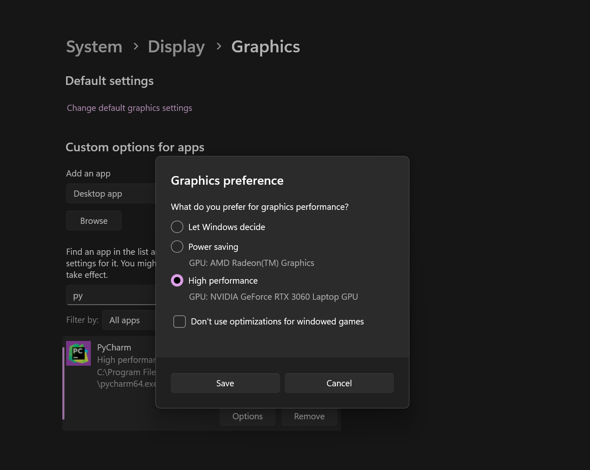

# Table Of Contents

* [Application Based Issues](#application-based-issues)
  * [How to use the Program](#how-to-use-the-program)
    * [Adding a Label to an Image](#adding-a-label-to-an-image)
    * [Creating A Dataset](#creating-a-dataset)
    * [Training a model](#training-a-model)
      * [Adjusting Settings and Selecting a model](#adjusting-settings-and-selecting-a-model)
        * [Models](#models)
        * [Datasets](#datasets)
* [Training Issues](#training-issues)
      * [Using a CPU](#using-a-cpu-)
  * [Closing Notes](#closing-notes)

  
# Application Based Issues

If nothing is working at all, you probably forgot to set a project directory. To do that click 'Set Project Directory'
on either the initial window, or the annotation window.

## How to use the Program

The application starts on the Main Window, if you are simply seeking to create a model from scratch you first need
to hit 'Create Model &rAarr; Open Annotation Window'. From there you can click 'Add Images' and select one of the 
options. Note: hitting 'Select Folder' will remove all currently loaded files, this is intentional, it will not
remove them from the dataset, to reload those images just reload the directory.

Hitting Run will prompt you to select a model, there are some base models included by default, you can
find more  <a href=https://docs.ultralytics.com/models/yolov8/#supported-tasks-and-modes>here</a>. You do need
a webcam of sorts, but in the future I will add a mode that will be able to get predictions based on videos
and images, which will then be saved to your project directory.

Hitting End, will stop the camera

IMPORTANT: Use the slider or enter a value into the text box labeled confidence to adjust the accuracy threshold
for the model.

### Adding a Label to an Image

You may have noticed the toolbar on the left side of the Annotation Window, and you may have also noticed that
the polygon tool is selected by default, that and the bounding box tool are the two annotation modes currently supported.
Clicking a different mode than the currently selected won't cause issues when using the yolov8n-seg.pt model during
training, but it might when using yolov8n.pt.

### Creating A Dataset

So, you're ready to create a dataset. Simply hit 'Create Training Set' and it will work it's magic. You can then
safely close the Annotation Window.

As a side note, I'm working on getting image generation / image modification working, for better results.

### Training a model

To begin the process hit, 'Create Model &rAarr; Train Model'
 

#### Adjusting Settings and Selecting a model

Some of these can be confusing, for a more detailed explanation please go to 
<a href=https://docs.ultralytics.com/models/yolov8/#supported-tasks-and-mode>Ultralytics.com</a>

* Epochs
  * The amount of training iterations, i.e. the more of these, generally the better the accuracy.
* Patience
  * The maximum amount of epochs without improvement, setting this value to 0 disables this.
* There are more settings not listed here, that are not implemented due to time, but I will implement an advanced settings menu at some point

***

##### Models

Select one of these during training to ensure that it's configured for the task you want

* yolov8n
  * The quickest, works only with bounding box detection
* yolov8n-cls
  * The simplest, assigns a class to the whole image
  * By default, if you have no annotations drawn when changing images, it will just write the currently selected class to the image's label file
* yolov8n-seg
  * A more accurate model, only truly compatible with the polygon tool, takes longer to train than yolov8n
* anymodel(s,m,l,x)
  * In order, these are more accurate but require exponentially more processing power for each iteration you increase
  * By default, these are not included in the repo due to GitHub's file size limit, I plan on implementing a script at some point to install these

***

##### Datasets

This is where your data comes in. Currently, you just have to check the yaml to see the info it contains, but
I am working on adding better naming.

***
# Training Issues

Training with a GPU is Nvidia only, there just is not enough support for AMD cards at the moment.

If you are training a dataset, and you want to use a gpu first install Conda 3.10.

Once Conda is set as the interpreter run:

>conda install pytorch torchvision torchaudio pytorch-cuda=11.8 -c pytorch -c nvidia

>conda install -c conda-forge charset-normalizer

If you are having issues with getting the training to use the GPU, especially if you are on a laptop, make
sure that the GPU is enabled when the program/program interpreter is run. Also make sure your laptop is plugged in, 
in some cases the GPU will not run if it is not. See the figure below

<figure>
    
</figure>

***

#### Using a CPU 

You need a decent one, simply put, it takes a lot longer and requires more ram (since you no longer have VRAM).

 You <i>should</i> be able to run the training using 16GB of ram, however, even when using a GPU, I recommend 32GB.

***

## Closing Notes
* Ideally set up Conda, so you can use a GPU(if it's supported)
* Use an SSD ... <i>pretty please</i> ... your computer will thank you
* Ideally have over 16GB of RAM

***
_So Long, and Thanks for All the Fish_

